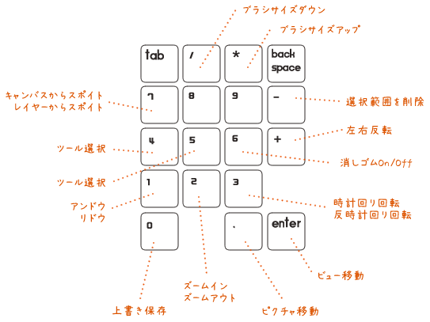

# Numpad4paint

自分用に作成した、テンキーパッドをお絵描き用左手デバイスとして使うためのAutoHotKeyスクリプトです。

現状、SAIのみに対応しています。

----

# Install

1. AutoHotKey をインストールします

2. SAIのショートカットを変更します

    1. ショートカット割り当てを以下のように変更します
        - `i` :: 表示イメージから色を拾う
        - `j` :: 作業中のレイヤーから色を拾う
    	- `r` :: 時計回り回転
    	- `shift + r` :: 反時計回り回転
		- `z` :: ズームイン
		- `shift + z` :: ズームアウト
        - `0~4` :: なし
		
	2. 普段使うツールのショートカットを `0~4` のどれかに割り当てる

----

# Usage

NumLock を ON にした上で使います。

複数の操作が割り当てられているキーは、`Enter`キーと一緒に押すことで挙動が変化します。
例えば、`1`を単体で押すとアンドウになり、`Enter`を押しながら`1`を押すとリドウになります。

`4`と`5`は、押す度にツールが切り替わります。
切り替わる順番は互いに逆向きです。

`6`を押すと消しゴムツールに切り替えます。
もう一度押すと元のツールに切り替えます。

`8`、`9`、`backspace`、`tab` には（まだ）何も割り当てていません。

なお、注意点としては、手持ちのテンキーパッドの入力コードの関係上、
`NumpadEnter`だけでなく`Enter`にもホットキーを割り当てています。
そのため、自由変形などの操作を`Enter`で確定することは出来ません。
